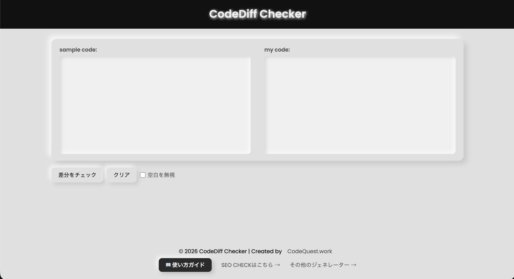

# CodeDiff Checker

テキストやコードの差分を簡単に確認できるWebツールです。

https://codequest.work/generator/diff-checker/



---

## 技術スタック

- [diff.js](https://github.com/kpdecker/jsdiff)（CDN読み込み・差分アルゴリズム）
- Vanilla HTML / CSS / JS（ビルド不要の静的サイト）

## ディレクトリ構成

```
.
├─ public/            # 公開ルート（この中身だけが本番へデプロイされる）
│  ├─ index.html      # ツール本体（日本語）
│  ├─ style.css       # 全ページ共有スタイル
│  ├─ app.js          # 差分ロジック
│  ├─ howto.html      # 使い方ガイド
│  ├─ ogp.png / sitemap.xml / llms.txt
│  └─ en/             # 英語版（../style.css を共有）
├─ docs/              # リポジトリ用ドキュメント素材（スクショ等・非デプロイ）
└─ .github/workflows/ # デプロイ設定
```

`public/` がそのまま本番の公開ルート。README や `docs/` などリポジトリ用ファイルを本番へ出さないための境界として分離している。

## ローカル起動

`public/` を任意のHTTPサーバーで配信するだけで動作します。

```bash
npx serve public
```

## デプロイ

`main` ブランチへの push で GitHub Actions が起動し、**SSH + rsync で ConoHa WING へ `public/` の中身を転送**します（`*.md` のみの変更ではデプロイをスキップ）。

必要な GitHub Secrets:

| Secret | 用途 |
|---|---|
| `SSH_PRIVATE_KEY` | SSH秘密鍵 |
| `SSH_HOST` | 接続先ホスト |
| `SSH_PORT` | SSHポート |
| `SSH_USER` | SSHユーザー |
| `DEPLOY_PATH` | 転送先ディレクトリ |
